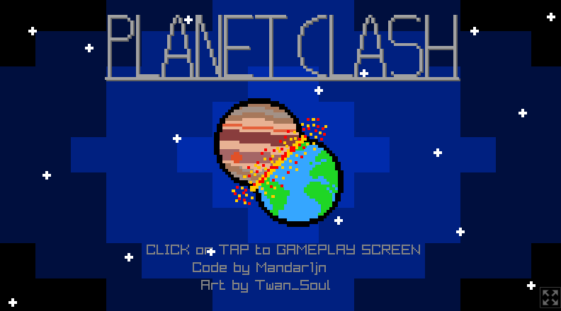
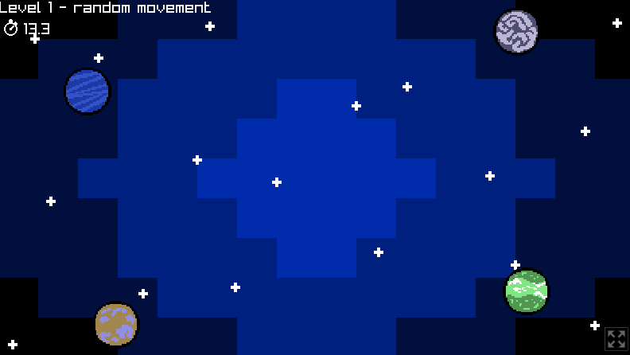
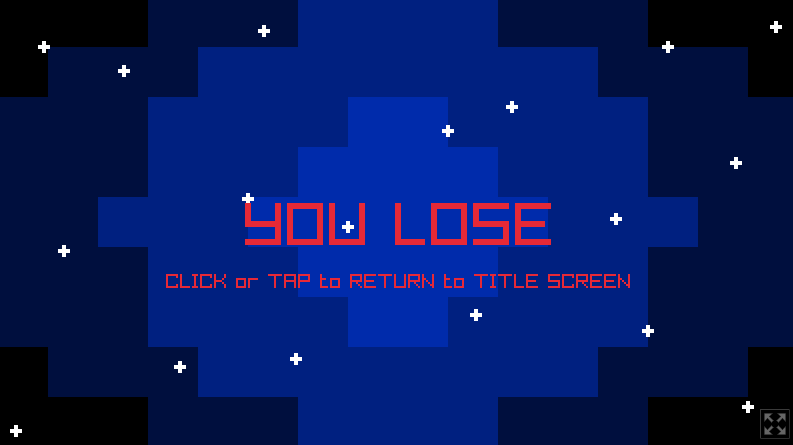

From January 21st until January 28 2022 raysan5, the creator of Raylib, hosted the [raylib 5K gamejam](https://itch.io/jam/raylib-5k-gamejam/) with the theme "That was close!" to celebrate that the discord reached 5k members.

Sadly, this jam started in the middle of a test week I had, so I could only do the minimal project setup in the first 5 days. That's why this game was really made in 2 days.

The theme reminded me of a tutorial series created by blackthornprod on [how to make a mobile game](https://www.youtube.com/watch?v=CGleQZVgdN4/). Because I was short on time I needed something with a somewhat smaller scope and this fit that bill perfectly.

The basic gameplay was made in the first day using the basic circle drawing function from raylib. 
This, of course, looked really bad. So, on the second day, my little brother created all the sprites you see in game while I expanded the gameplay and programmed in the sprites.

The game is available on [itch.io](https://mandar1jn.itch.io/planet-clash/) and the source is available on [github](https://github.com/mandar1jn/planet-clash/)

